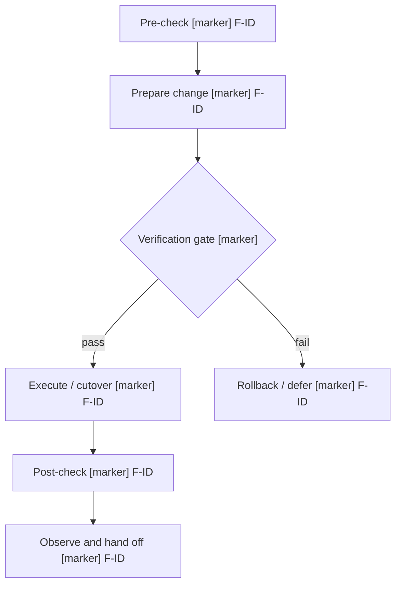

# Implementation Path Canvas Template

Use this when a production plan has multiple steps, optional steps, cutover, rollback, or post-change observation.

## Markers

- `[OK]` — sufficient evidence and operationally sound.
- `[GAP]` — required step, owner, command, artifact, or handoff is missing.
- `[RISK]` — step exists but has material production risk.
- `[ELEVATE]` — step forces a better design or native/baseline path.
- `[NEED-EVIDENCE]` — cannot judge without proof.

Every material finding in the report must appear on the canvas or in the path table.
